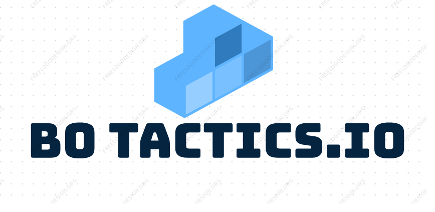
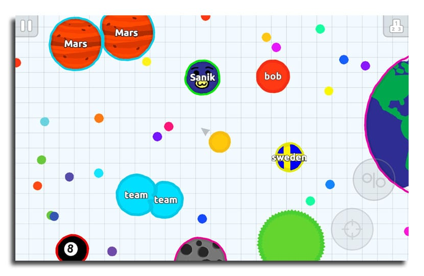
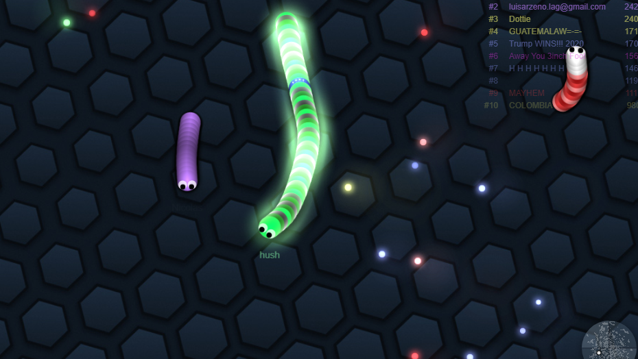
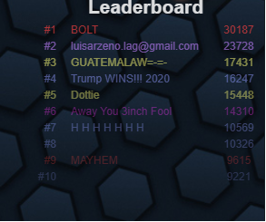
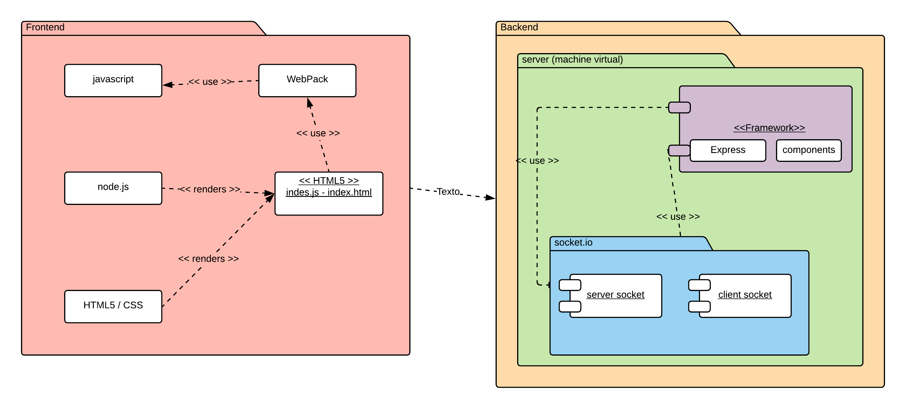

## Integrantes 🔧

* Andrés Vazquez 
* Andrés Rodríguez del toro 
* Nicolas Patiño 

## Resumen
B0Tactics.io es una adaptación del juego agar.io en el cual el jugador compite contra otros jugadores por el primer puesto, la meta del juego es llegar a la mayor cantidad de puntos posibles alcanzables.

## ¿ Qué necesidad cubre nuestro producto ?
cubre una necesidad de Entretenimiento en la industria de videojuegos que cada dia es mas demandada.

## ¿ Cual es nuestra idea de negocio ?

   + ### terminos academicos:
       + Ofrecerla a nuestros compañeros del b0 un medio de entretenimiento.
   + ### terminos de negocio:
       + Utilizaremos el modelo de negocio "cebo y anzuelo" para generar ganancia a futuro ofreciendo desde el principio un juego optimo          y de calidad con pequeñas microtransacciones para "desbloquear" mejoras.

 
## Nicho de Mercado
+ **a usuarios niños y adolescentes que son apasionados por los videojuegos o simplemente buscan un momento de distracción donde puedan desarrollar inconscientemente habilidades como:**

    + Competitividad
    + Trabajo en Equipo ( modo equipos )
    
+ **Tipos de Jugadore que podremos tener**

    + Achievers (Conquistadores) su objetivo es resolver retos y recibir recompensas por ello.
    + Explorers (Exploradores) Quieren conocer y descubrir todo lo que el juego tenga para ofrecer.
    + Socializers (Socializadores) La experiencia, la comunidad es lo que realmente les motiva a estar en el juego.
    + Killers (Asesinos) Los que buscan competir y sobresalir, los que disfrutan venciendo, si no aplastando a los demás.
    

## Descripción
_B0Tactics.io es una adaptación de los juegos de extensión .io la mecánica de estos juegos consiste en un grupo de jugadores que compiten para llegar al primer lugar obteniendo la mayor cantidad de puntos, estos juegos no tienen una victoria definida clara.
#
El proyecto consiste en que cada jugador controla un Personaje , este personaje se desplazara por el mapa consumiendo puntos que lo ayudaran a crecer de tamaño y competir contra los otros jugadores, la meta es aumentar el tamaño del personaje, y mantenerse en la cima de putuaciones.
#
Al iniciar el juego el usuario aparece con un personaje de un tamaño predeterminado pequeño y sin puntos. En el mapa apareceran pequeños puntos que seran consumibles por el jugador y le permitiran aumentar sus puntos y su tamaño, adicional a esto se pueden conseguir puntos consumiendo a otro jugador, esta sera la manera mas efectiva de aumentar el tamaño  pero tambien la mas arriesgada ya que al haber un enfrentamiento el personaje de menor tamaño resultara perdedor.El jugador tambien dispondra de la posibilidad de obtencion de pequeñas ayudas temporales que apareceran de forma aleatoria en el mapa.
* **poderes :**

  * **invencibilidad :**_le permitirá a un usuario ser indestructible por un periodo corto de tiempo (ningún jugador más grade que este                            podrá consumirlo y no le afectaran los demás poderes.
  * **Crecimiento Excesivo :** el jugador incrementara el doble de su tamaño por un periodo corto de tiempo.
  * **proyectiles :** el jugador adquiere la habilidad de lanzar proyectiles a su alrededor en un radio de alcance determinado.
  * **Velocidad :** El jugador adquiere un incremento en su velocidad de movimiento.

## Historias de usuario
* **Historias Colaborativas :**
   * Consumir jugador
   * Conseguir Poderes
   * Conseguir puntos
* **Historias no Colaborativas :**
   * Registro
   * Login
   * Agregar skin
   * Unirse a partida
   * Records

_las historias de usuario estarán disponibles en el siguiente link:_
https://tree.taiga.io/project/nicolaspatino-b0tacticsio/backlog

## Diagrama de Arquitectura General del proyecto

## Software posiblemente a usar para la iniciacion del proyecto.

   + ### express:
       + Express.js es un framework para Node.js que sirve para ayudarnos a crear aplicaciones web en menos tiempo ya que nos
       proporciona funcionalidades como el  enrutamiento, opciones para gestionar sesiones y cookies, etc...
       
   + ### socket.io:
       + es una librería que nos permite manejar eventos en tiempo real mediante una conexión TCP y todo ello en JavaScript. Es
       realmente potente y podremos hacer que el real time en nuetra aplicacion sea realmente optimo.
       
   + ### webpack:
       + es un empaquetador de modulos asimples palabras pero tiene caracteristicas que podrian brindarnos a este proyecto como:
        + separando el código en módulos que luego se utilizan como dependencias en otros módulos. Una de las cosas que hace
           realmente bien Webpack es la gestión de esos módulos y de sus dependencias, pero también puede usarse para cuestiones como
           concatenación de código, minimización y ofuscación, verificación de buenas prácticas (linting), carga bajo demanda de
           módulos, etc...
        + Una de las muchas cosas interesantes de Webpack es que no solo el código JavaScript se considera un módulo. Las hojas de
        estilo, las páginas HTML e incluso las imágenes se pueden utilizar también como tales, lo cual da un extra de potencia muy
        interesante.

